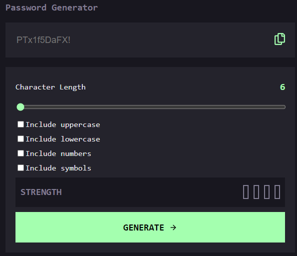

# Password Generator App



This is a simple, user-friendly application that allows users to generate secure passwords based on selected options. Users can copy the generated password to their clipboard, see a strength rating for the password.

## Features

- **Password Generation**: Generate a password based on selected inclusion options (uppercase letters, lowercase letters, numbers, symbols).
- **Clipboard Copy**: Copy the generated password to your clipboard with a single click.
- **Password Strength Rating**: View a strength rating for the generated password to ensure security.
- **Responsive Design**: The interface adapts to different device screen sizes for optimal user experience.


## Installation

1. Clone the repository:
   ```bash
   git clone https://github.com/estherlardze/password-gen.git
   ```
2. Navigate to the project directory:
   ```bash
   cd password-gen
   ```
3. Install the dependencies:
   ```bash
   npm install
   ```

## Usage

1. Start the development server:
   ```bash
   npm run dev
   ```
2. Open your browser and go to `http://localhost:5173/` to view the app.
3. Select the options for password generation (e.g., include uppercase, lowercase, numbers, symbols).
4. Click the "Generate Password" button to create a new password.
5. View the generated password and its strength rating.
6. Click the "Copy to Clipboard" button to copy the password.

## Technologies

- **React**: A JavaScript library for building user interfaces.
- **Typescript**: For checking data types.
- **JavaScript**: For logic and interactivity.


